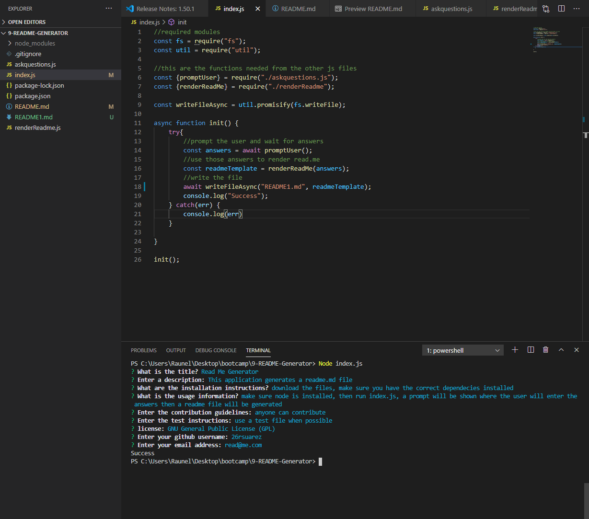

# 9-README-Generator

#  

### Table of Contents
**[Description](##description)** 
**[Installation Instructions](#installation-instructions)** 
**[Usage Instructions](#usage-instructions)** 
**[License](#license)** 
**[Contributing](#contributing)** 
**[Tests](#tests)** 
**[Questions](#questions)** 

## Description
This command line application generates a README file. The user can run the index.js file in node. They will then be prompted with questions. The answers will be used to generate a readme.md file. The file will be created and stored in their working directory.

## Installation Instructions
Make sure you have cloned the .js files and the .json files. Then make sure you have node installed. Use "npm install" to install the required dependencies. You can use the command "node index.js" to run the application

## Usage Instructions

This application is run using node. Here is a picture of the terminal in VSCode

The link below takes you to a video that shows how the readme file is generated.
https://drive.google.com/file/d/1iPV2QSn34k6qDYITQtEXhYjdUL5IePVX/view

## License

MIT 

Copyright 2020 Raunel Suarez-Magana

Permission is hereby granted, free of charge, to any person obtaining a copy of this software and associated documentation files (the "Software"), to deal in the Software without restriction, including without limitation the rights to use, copy, modify, merge, publish, distribute, sublicense, and/or sell copies of the Software, and to permit persons to whom the Software is furnished to do so, subject to the following conditions:

The above copyright notice and this permission notice shall be included in all copies or substantial portions of the Software.

THE SOFTWARE IS PROVIDED "AS IS", WITHOUT WARRANTY OF ANY KIND, EXPRESS OR IMPLIED, INCLUDING BUT NOT LIMITED TO THE WARRANTIES OF MERCHANTABILITY, FITNESS FOR A PARTICULAR PURPOSE AND NONINFRINGEMENT. IN NO EVENT SHALL THE AUTHORS OR COPYRIGHT HOLDERS BE LIABLE FOR ANY CLAIM, DAMAGES OR OTHER LIABILITY, WHETHER IN AN ACTION OF CONTRACT, TORT OR OTHERWISE, ARISING FROM, OUT OF OR IN CONNECTION WITH THE SOFTWARE OR THE USE OR OTHER DEALINGS IN THE SOFTWARE.

## Contributing
Feel free to contribute or raise any issue

## Tests
As I continue to learn about testing i will add a test file.

## Questions
Contact me at https://www.github.com/26rsuarez
or at rsuarez_26@utexas.edu

